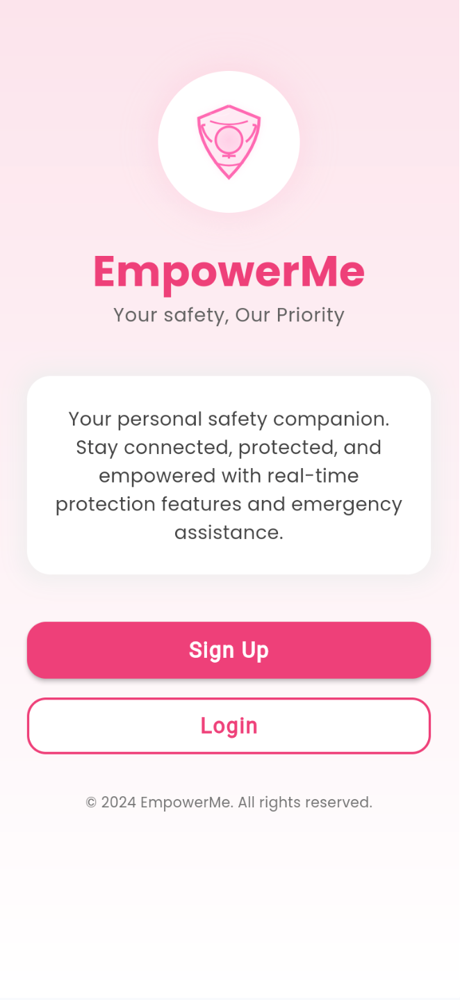
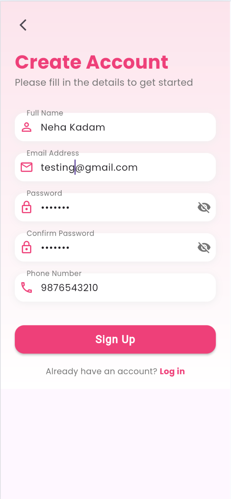
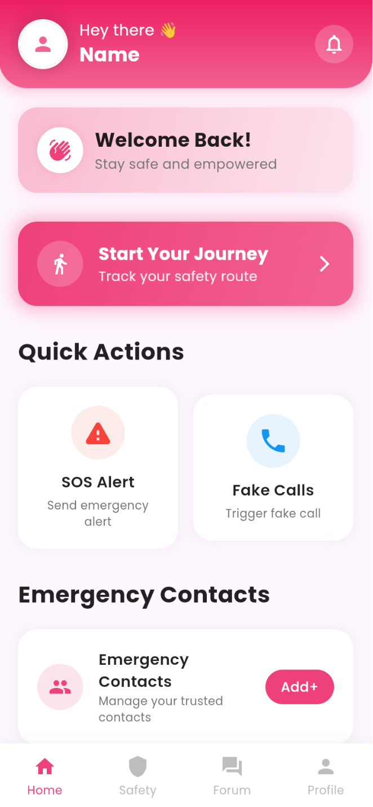
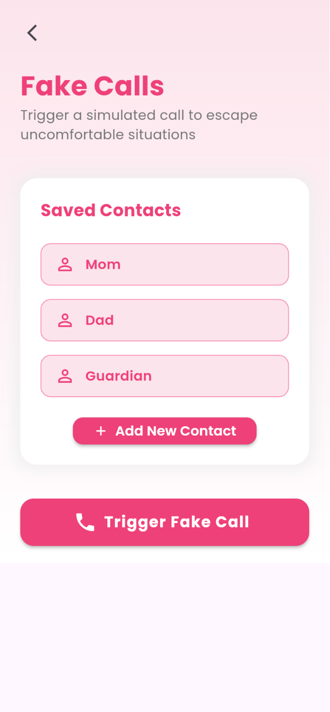
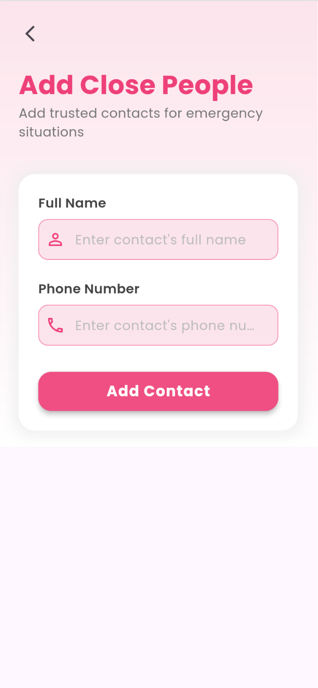
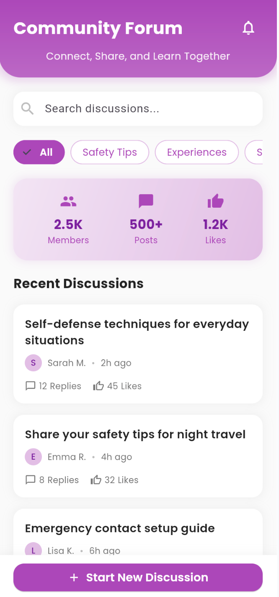
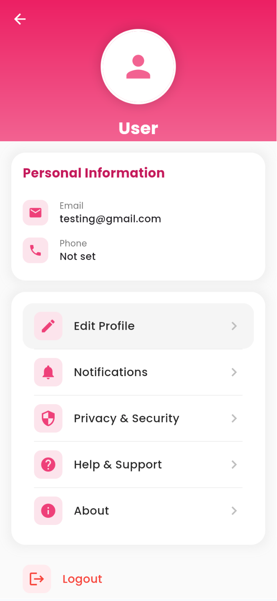

# 🛡️ EmpowerMe — Your Safety, Our Priority

> A women's personal safety companion app built with Flutter & Firebase, developed as a 2nd Year Mini Project at Ramrao Adik Institute of Technology.

---

## 📱 Screenshots

<p float="left">
  
  
  
  
</p>
<p float="left">
  
  
  
</p>

---

## 🌟 About

**EmpowerMe** is a mobile safety application designed to help women stay protected in emergency situations. The app provides real-time location sharing, SOS alerts, fake call triggers, and a trusted contacts system — all in a clean, intuitive interface.

---

## ✨ Features

- 🔐 **User Authentication** — Secure sign up and login using Firebase Auth
- 🆘 **SOS Alert** — Instantly send an emergency alert to trusted contacts
- 📍 **Live Location Sharing** — Share real-time location with emergency contacts
- 📞 **Fake Call** — Trigger a simulated incoming call to escape uncomfortable situations
- 👥 **Emergency Contacts** — Add and manage trusted contacts for emergency situations
- 💬 **Community Forum** — Connect, share safety tips, and learn together with other users
- 👤 **User Profile** — Manage personal information, notifications, and privacy settings

---

## 🛠️ Tech Stack

| Technology | Usage |
|------------|-------|
| Flutter | Cross-platform mobile & web UI |
| Dart | Programming language |
| Firebase Auth | User authentication |
| Firebase Firestore | Database for contacts & user data |
| Google Maps API | Live location sharing |

---

## 🚀 Getting Started

### Prerequisites
- Flutter SDK (3.0+)
- Dart SDK
- Android Studio / VS Code
- Firebase project setup

### Installation

1. **Clone the repository**
```bash
git clone https://github.com/NehaKadam26/Empower_me.git
cd Empower_me
```

2. **Install dependencies**
```bash
flutter pub get
```

3. **Set up Firebase**
   - Create a Firebase project at [firebase.google.com](https://firebase.google.com)
   - Add your `google-services.json` to `android/app/`
   - Add your `GoogleService-Info.plist` to `ios/Runner/`
   - Enable Email/Password authentication in Firebase Console

4. **Run the app**
```bash
flutter run
```

---

## 👩‍💻 Team

| Name | GitHub |
|------|--------|
| Neha Kadam | [@NehaKadam26](https://github.com/NehaKadam26) |
| Ishita Sharma | — |
| Dilkush Janwa | [@dilkush-31](https://github.com/dilkush-31) |
| Hitarth Khot | [@hitarthruns](https://github.com/hitarthruns) |

> 2nd Year Mini Project — Ramrao Adik Institute of Technology

---

## 📄 License

This project is for academic purposes. All rights reserved © 2024 EmpowerMe.
